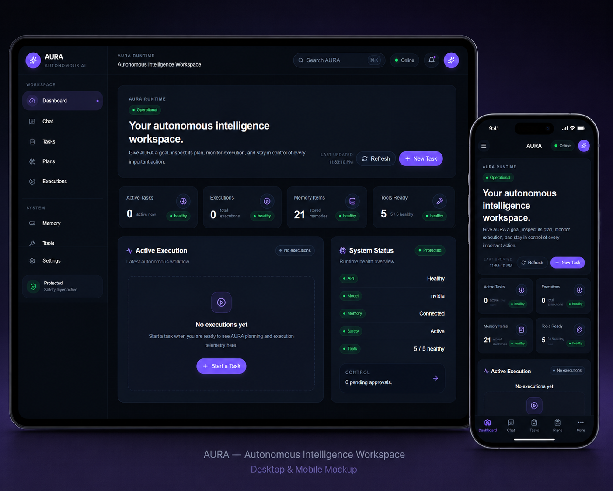

# Temiloluwa Faith Kareem — Developer Portfolio

A responsive portfolio website showcasing my work across full-stack development, artificial intelligence, cybersecurity, frontend engineering, and UI/UX design.

**[View the live portfolio](https://faith-portfolio.vercel.app)** · **[GitHub](https://github.com/Faith-loves)** · **[LinkedIn](https://www.linkedin.com/in/temiloluwa-faith-kareem-a526b7420)** · **[Email me](mailto:omolarak724@gmail.com)**



## About me

I am Temiloluwa Faith Kareem, a Computer Science student and full-stack developer focused on building polished, secure, and scalable web products. I work across product design and engineering, turning ideas into responsive interfaces, practical user flows, and deployment-ready applications.

My core tools include React, Next.js, JavaScript, Node.js, FastAPI, MongoDB, REST APIs, Tailwind CSS, Git, Figma, and security-aware development practices.

## Featured work

| Project | Focus | Live demo |
| --- | --- | --- |
| **AURA-AI** | Autonomous AI workspace for planning, tool execution, monitoring, and human approvals | [Open project](https://aura-ai-psi-steel.vercel.app/) |
| **Deceivra** | Context-aware scam detection with explainable threat analysis and safety recommendations | [Open project](https://deceivra.vercel.app/) |
| **Blockchain Voting** | Secure voting flow with verification, ballot review, confirmation, and audit awareness | [Open project](https://blockchain-voting-5ob8.vercel.app/) |
| **AI Smart UI** | Prompt-first AI interface for generating palettes and responsive UI concepts | [Open project](https://ai-smart-ui.vercel.app/) |
| **SentinelX** | Cybersecurity operations dashboard for threat monitoring and incident investigation | [Open project](https://sentinelx-pi.vercel.app/) |
| **Nevermind Store** | Responsive ecommerce frontend with product discovery, cart, and account flows | [Open project](https://nevermind-store-sigma.vercel.app/) |
| **TaskFlow Pro** | Productivity platform with dashboards, Kanban workflows, and analytics | [Open project](https://taskflow-pro-8.vercel.app/) |
| **Intern Track** | Internship application tracker for statuses, deadlines, interviews, and follow-ups | [Open project](https://intern-track-sable.vercel.app/) |
| **CipherPass** | Security-focused password generator and access-management product | [Open project](https://cipher-pass-beta.vercel.app/) |
| **DevDocs AI** | AI developer tool for finding, simplifying, and applying technical documentation | [Open project](https://dev-docs-ai-lac.vercel.app/) |

Every project also has a dedicated case study inside the portfolio, covering the problem, my approach, product decisions, implementation process, and outcome.

## Portfolio features

- Responsive layouts for desktop, tablet, and mobile
- Dedicated Home, Projects, About, Contact, and project case-study pages
- Filterable project collection covering Full Stack, Frontend, AI, Security, and UI/UX
- Live project, GitHub, resume, LinkedIn, and email links
- Multiple selectable color themes
- Motion and page transitions powered by Framer Motion
- Accessible semantic structure and keyboard-friendly controls
- Vercel-compatible routing for direct case-study URLs
- SEO metadata and structured person data

## Built with

- React 19
- Vite 7
- JavaScript and JSX
- Framer Motion
- Tailwind CSS
- PostCSS and Autoprefixer
- Custom responsive CSS
- Vercel

## Run locally

### Requirements

- [Node.js](https://nodejs.org/) 20.19 or newer
- npm, included with Node.js
- [Git](https://git-scm.com/) for version control

### Installation

```bash
git clone https://github.com/Faith-loves/MYPORTFOLIO.git
cd MYPORTFOLIO
npm install
npm run dev
```

Open the local address printed by Vite, normally `http://127.0.0.1:5173`.

On Windows PowerShell systems that block `npm.ps1`, use:

```powershell
npm.cmd install
npm.cmd run dev
```

## Available commands

| Command | Purpose |
| --- | --- |
| `npm run dev` | Start the local development server |
| `npm run build` | Create an optimized production build in `dist/` |
| `npm run preview` | Preview the production build locally |

## Project structure

```text
MYPORTFOLIO/
├── public/          # Project screenshots, resume, and favicon
├── src/
│   ├── main.jsx     # Portfolio data, routes, and React components
│   └── styles.css   # Design system and responsive styling
├── index.html       # Metadata and application entry point
├── package.json     # Scripts and dependencies
└── vercel.json      # SPA routing configuration
```

## Contact

I am open to internships, junior developer roles, freelance projects, and collaborations involving full-stack development, AI products, cybersecurity interfaces, or frontend engineering.

- Email: [omolarak724@gmail.com](mailto:omolarak724@gmail.com)
- LinkedIn: [Temiloluwa Faith Kareem](https://www.linkedin.com/in/temiloluwa-faith-kareem-a526b7420)
- GitHub: [Faith-loves](https://github.com/Faith-loves)

---

Designed and developed by **Temiloluwa Faith Kareem**.
